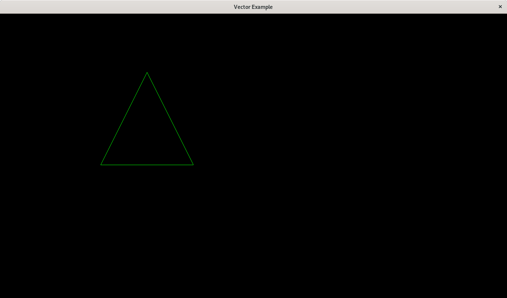

# vector.h
 

A toy single-header C library for vector math.

## Usage
After cloning the repository, simply run `make` to compile the test suite.

## Examples
Here's a screenshot of a moving triangle in SDL. It uses the vector structures
and functions from `vector.h`

